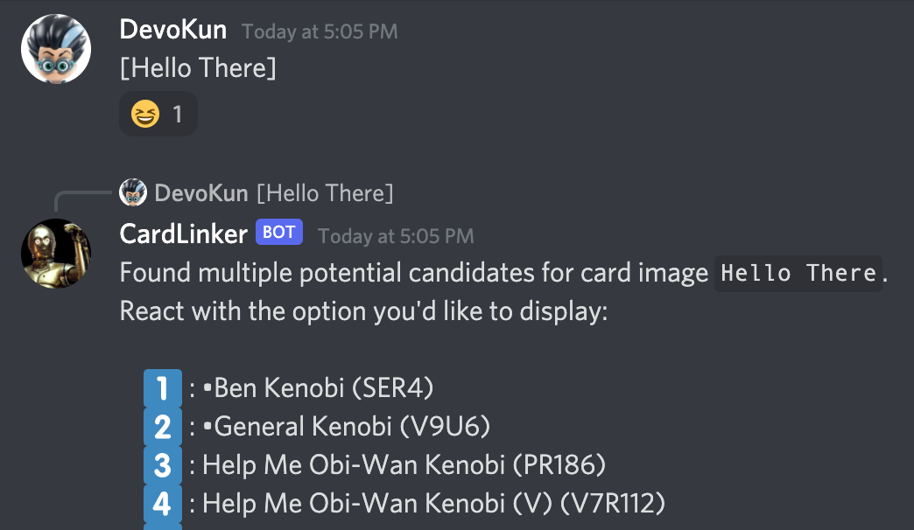

## Bot Commands

* `[card name]` for the image

* `{card name}` for the [scomp link](httsp://scomp.starwarsccg.org)




## Upstream code changes

* Fork of [LOTR Discord Card Linker](https://github.com/PlayersCouncil/DiscordCardLinker).
* Always develop in [LOTR Discord Card Linker](https://github.com/PlayersCouncil/DiscordCardLinker). and merge to this repo.

### Downstream code changes:

* Custom `Dockerfile` to automate builds and image creation.
* Updated responses in `CardBot.cs`
* Updated `Settings.cs` to use environment variables instead of `settings.json`
* Removed `settings.json` from `DiscordCardLinker.csproj`


## Build

* The code is built in a Docker container.
* The compiled code is inserted in to a container image.
* The `DiscordCardLinker/Dockerfile` is used to build the image.

```bash
./build.sh
```


## Create the Bot

* Create an Application Bot
* Feed the Client ID and Token ID to the app as environment variables:
```
ENV TOKEN               "xxxxxxx"
ENV CLIENTID            "xxxxxxx"
ENV PERMISSIONS         "xxxxxxx"
ENV BASEIMAGEURL        "https://res.starwarsccg.org/cards/Premiere-Dark/large/darthvader.gif"
ENV BASEWIKIURL         "https://scomp.starwarsccg.org/"
ENV MAXIMAGESPERMESSAGE "5"
```

## Run the bot

* Feed the Client ID and Token ID to the app as environment variables:

```bash
docker run -ti \
  -e TOKEN="xxxxxxxxx" \
  -e CLIENTID="xxxxxxxxx" \
  -e PERMISSIONS="xxxxxxxxx" \
  -e BASEIMAGEURL="https://res.starwarsccg.org/cards/Premiere-Dark/large/darthvader.gif" \
  -e BASEWIKIURL="https://scomp.starwarsccg.org/" \
  -e MAXIMAGESPERMESSAGE="5" \
  discordcardlinker:latest
```


## Invite the bot to Discord

* When the bot is running, within Discord, Invite the bot to the server.


## cards.tsv

* `cards.tsv` is a tab seperated csv file used by the app.
* The file is built **automatically** by `make_cards_tsv.py`.<br />DO NOT EDIT `cards.tsv` directly. Any changes you make to that file will be overwritten.
* Any data in `cards.tsv` will be sourced from the [json card data files](https://github.com/swccgpc/swccg-card-json).

### Columns

* `CollInfo`, `Title`, `Subtitle`, and `Nicknames` are all values that users can search for.
* In **LOTR CCG**, personas always have the same title, so the subtitle is here used as a tiebreaker that can be directly referenced

* `TitleSuffix` column is for disambiguation, and would contain `(V)`, or `(AI)`, etc.

* `Nicknames` is a comma seperate list. Such as:
```
Obi-Wan,Kenobi,General Kenobi,Hello There
```


